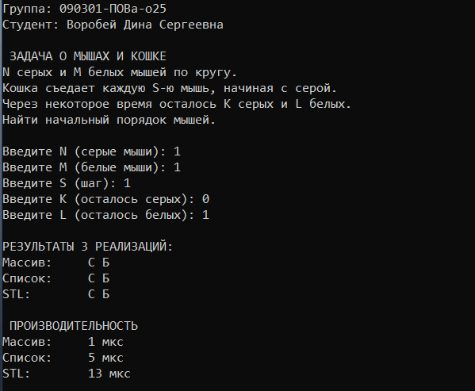

# Лабораторная работа 3
# Задание:
Каждая задача требует использовать некоторую структуру данных : стек, очередь и тд
Следует реализовать структуру данных 3 способами
 А) через массив
 Б) через связанный список
 В) с использованием стандартной библиотеки языка (например, STL для С++)
Сравнить работоспособность и производительность каждой реализации.
N серых и M белых мышей сидят по кругу. Кошка ходит по кругу по часовой стрелке и съедает каждую S -тую мышку. В первый раз счет начинается с серой мышки. Составить алгоритм определяющий порядок в котором сидели мышки, если через некоторое время осталось K серых и L белых мышей.
# Листинг программы
```python
import time
from collections import deque


def pokrasit_mishes(total, eliminated, survived, N, M, K, L):
    result = [None] * total  
    eaten_grey = N - K      
    
    #  те, кого съели
    for i in eliminated:
        if eaten_grey > 0:
            result[i] = "С"
            eaten_grey = eaten_grey - 1
        else:
            result[i] = "Б"
            
    #  кто выжил
    for i in survived:
        if K > 0:
            result[i] = "С"
            K = K - 1
        else:
            result[i] = "Б"
            
    return "".join(result)

#через массив
class ArrayQueue:
    def __init__(self, emkost):
        self.emkost = emkost
        self.queue = [None] * emkost
        self.head = 0
        self.tail = 0
        self.size = 0

    def end(self, element):
        self.queue[self.tail] = element
        self.tail = (self.tail + 1) % self.emkost
        self.size = self.size + 1

    def nachalo(self):
        element = self.queue[self.head]
        self.queue[self.head] = None
        self.head = (self.head + 1) % self.emkost
        self.size = self.size - 1
        return element

def solve_array(N, M, S, K, L):
    total = N + M
    q = ArrayQueue(total)
    for i in range(total):
        q.end(i)
        
    eliminated = []
    while q.size > (K + L):
        for _ in range(S - 1):
            q.end(q.nachalo())
        eliminated.append(q.nachalo())
        
    survived = []
    while q.size > 0:
        survived.append(q.nachalo())
        
    return pokrasit_mishes(total, eliminated, survived, N, M, K, L)


# через список
class Node:
    def __init__(self, znachenie):
        self.znachenie = znachenie
        self.sleduyushiy = None

class LinkedListQueue:
    def __init__(self):
        self.head = None
        self.tail = None
        self.size = 0

    def end(self, element):
        new_node = Node(element)
        if self.tail is None:
            self.head = self.tail = new_node
        else:
            self.tail.sleduyushiy = new_node
            self.tail = new_node
        self.size = self.size + 1

    def nachalo(self):
        element = self.head.znachenie
        self.head = self.head.sleduyushiy
        if self.head is None:
            self.tail = None
        self.size = self.size - 1
        return element

def solve_linked_list(N, M, S, K, L):
    total = N + M
    q = LinkedListQueue()
    for i in range(total):
        q.end(i)
        
    eliminated = []
    while q.size > (K + L):
        for _ in range(S - 1):
            q.end(q.nachalo())
        eliminated.append(q.nachalo())
        
    survived = []
    while q.size > 0:
        survived.append(q.nachalo())
        
    return pokrasit_mishes(total, eliminated, survived, N, M, K, L)

# через библ
def solve_stdlib(N, M, S, K, L):
    total = N + M
    q = deque(range(total))
    
    eliminated = []
    while len(q) > (K + L):
        for _ in range(S - 1):
            q.append(q.popleft())
        eliminated.append(q.popleft())
        
    survived = list(q)
    return pokrasit_mishes(total, eliminated, survived, N, M, K, L)


if __name__ == "__main__":
    N_mice = int(input("Введите N (серые мыши): "))
    M_mice = int(input("Введите M (белые мыши): "))
    S_step = int(input("Введите S (шаг): "))
    K_survived = int(input("Введите K (осталось серых): "))
    L_survived = int(input("Введите L (осталось белых): "))

    

    # 1. Массив
    t0 = time.time()
    res_array = solve_array(N_mice, M_mice, S_step, K_survived, L_survived)
    print(f"1) Массив: {time.time() - t0:.6f} сек.")

    # 2. Связанный список
    t0 = time.time()
    res_ll = solve_linked_list(N_mice, M_mice, S_step, K_survived, L_survived)
    print(f"2) Связанный список: {time.time() - t0:.6f} сек.")

    # 3. Стандартная библиотека
    t0 = time.time()
    res_std = solve_stdlib(N_mice, M_mice, S_step, K_survived, L_survived)
    print(f"3) Стандартная библиотека: {time.time() - t0:.6f} сек.")
    
    print(f"\nначальный порядок мышей в кругу:")
    print(res_std)

```
# Результаты

